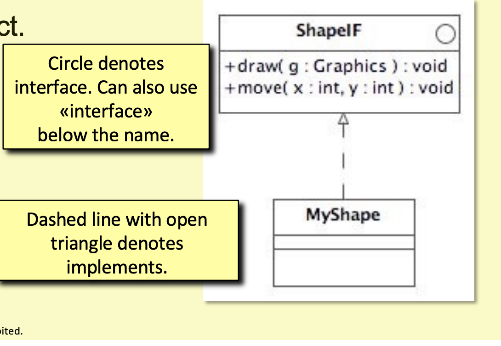
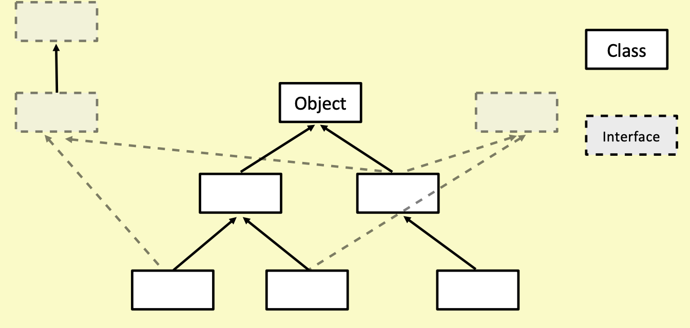

# Note for Week 5 COMP0004

Zhouzhou

# Lecture 13

Feb 10 Mon

## Super and variables

Variables declared in a super class is called "hidden" in a sub class. Such variables can be
accessed using super. We need super as a perpend because there might be a variable with the exact
same name, for example, this.x and super.x, they are both x but they are not really the same thing.

    super.x = 10;

## Template method, Final

Template method is a design pattern, where you write everything as a method and compose these
methods together as a whole method.

    void method(){
        doSometing();
        doOtherThing();
    }

    protected void doSomething(){//...};
    protected void doOtherThing(){//...};

And this method can be inherited to other methods and overrides some methods.

    class newMethod extends method {
        @override
        protected void doSomething(){
            System.out.println("This is a new method");
        }
    }

Prepending **final** to a function can stop it from being overridden.

    public final void doSomething(){//...};

## Inheritance and association

-   When to use inheritance?: The subclass is the extension of this class.
- When to use association?: The subclass only needs a few methods of this class.

## Java Record

A class specialised for representing data objects.

-   The fields are listed in parentheses.
- Nothing in the braces

An example.

    public record Book(String title, String author, int pages){}

Declare an instance as usual though:

    Book b = new Book("a,"b",10);

Access fields like this. Notice that all these instances are final, which means they are not
allowed to change.

    String title = b.title();
    String author = b.author();

You can add methods to a record.

    public record Book (String title, String author, int pages) {
        public boolean isLongBook() { return pages > 250; }
    }

## Implementation of Java Record

A Java Record is still a class, but a class with methods getting the instance variables,
generating hash codes, comparing with each other. Regarding comparing, the logic to compare
two classes is determined by the programmer, for example, how is "equals" being considered?
The following is a pattern of the implementation of equals

    @Override
    Declaration(class o){
        if(object passed in is exactly this class) {return true}
        if(not the same class) {return false}
        Cast o to be this class
        return {Boolean expression}
    }

Another thing is generating hash code. Hash code is a fixed-size numerical value generated by a
hash function, which maps a value to a number. Ideally every distinct object will map to a unique
hash code, allowing efficient storage and access in a range of data structures. There should
be a hash method for every distinct class, through override.

    @Override
    public int hashCode(){
        return Objects.hash(name,age);
    }

Additionally, the instance of the same object should be able to compare with each other.
We can define a rule to determine whether two objects are the same. The following is a
useful template:

1. See if it is being compared with itself.
2. See if it is being compared with different class
3. Cast another object to the same class, even though you are sure that they are the same class
4. Do actual comparison.

An example.

    public boolean equals(Object o){
      if(this == o) return true;
      
      if(o == null || getClass() != o.getClass()){
        return false;
      }

      Person p = (Person) o;
      
      return age == p.age && name.equals(person.name);
    }

## Tuple

Java doesn't have a built-in Tuple type, but we can implement it using record.

    public record Pair(int a, int b) {}

    //Generic version
    public record Tuple<T1, T2>(T1 a, T2 b) {}

This tuple now behaves just like a built-in type. For example, we can declare
an array of Tuple.

    ArrayList<Tuple<String, Integer>> tList = new ArrayList()<>;

# Lecture 14 I guess

Feb 19, yeah it's reading week I am catching myself up with all these slides.

## Interface

Interface is a kind of logic that has been already defined. Just like you know how to breathe
, but you probably never know why you should and how you make it unless you are some doctor.
There is a keyword "interface" in Java, allowing you to define such a logic for other classes.

    public interface ShapeIF{
        void draw(Graphics g);
        void move(int x, int y);
    }

Implementing the interface like this:

    class MyShape implements ShapeIF{
        //override draw() and move()
    }

In UML, a circle means that it is an interface. And "Dashed line with open triangle" means
the implementation of this interface.

Using type "ShapeIF" is compatible with all the subclasses.

    for(ShapeIF shape:shapes) {}

Interfaces in Java allow us to declare types independently of classes and class hierarchy.
A class can implement several interfaces. An interface can be referred to some classes that
are not inherited from each other.

Interfaces can have default methods. For example, you can use getFullName() on any
class that implemented the interface, until you implement its own version of getFullName().

    public interface Nameable{
        String getFirstName();
        String getSecondName();
        default String getFullName(){
            return getFirstName() + getSecondName();
        }
    }

## <? super T> and <? extends T>

"Producer extends, consumer super" this is what called "PECS" principle. This is very abstract
idea in Java. "<? super T>" means the data type you passed in can be any type that "T" inherited
from. See the following example, "List<? super Integer> list" says that list can be of any type
that Integer can inherit from, including itself. Hence, you are totally fine to add a "10" to 
this list, because list can take any superclass of Integer, and 10 is definitely an integer, or
a superclass of integer. But you are not allowed to take a data from this list, because the data
might be integer, or might be some superclass of integer, which means you are not sure. So when you
use "list.get(0);", you can only store it into an "Object" type. You don't know what it exactly is.
This is called "consumer".

    public void addElements(List<? super Integer> list){
        list.add(10);
        list.add(20);
        Object obj = list.get(0);
    }

"<? extends T>" means any type that is a subclass of T. See the following example, the "list" here
can be of any type that is a subclass of Integer, in other word, we can say that this list is of
class Integer, because a subclass of Integer is included in Integer. Hence, we are able to 
store the elements of list into Integer type. The actual type can be whatever the subclass of
Integer, but that doesn't matter, Integer is a superclass including all the subclass.

    public void readElements(List<? extends Integer> list){
        for(Integer n: list){
            //do something
        }
    }

A conclusion, we use "extends" when reading data and "super" when writing data. This is called
producer and consumer. Remember PECS principle.

